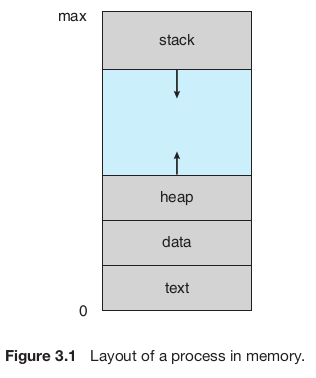
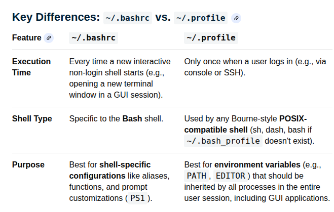

# Networks (Assessment/Interview Questions)
Q) A user wants to access/download multiple files (e.g., image, pdf, video, etc.) from a website. How does *HTTP1.1* handles this.?

Q) Why the use of IPv6 is being delayed.? What is the reason for that? 

Q) What is the main goal of CSMA/CD?

# OS (Assessment/Interview Questions)

Q) Trap vs interrupt

Q) Bealedy Anomaly

Q) What is the difference between process and thread? 

Q) What is a **Memory Leak** in cloud? How it happens? How can it be prevented?
- https://www.wiz.io/academy/application-security/memory-leaks

Q) What is **systemd** in Linux?

Q) Difference between ```~/.bashrc``` and ```~/.profile```? 

Q) What is Process memory layout?


Q) What is wrong with the below code snippet?
```
int *f(void) {
    return (int[]){1, 2, 3};
}
```
Ans) The moment function call ends, the memory is destroyed and the caller will receieve a memory location that was destryed after callee function execution is complete.

Q) What is process memory layout?

Ans) A process memory has four sections:

1. **Text Section:** The part of the process memory stores the executable code.
2. **Data Section:** The data section of the process memory stores global variables defined in the code.
3. **Heap Section:** This section is used to dynamically allocate memory during program run time (i.e., program execution).
4. **Stack Section:** This memory section stores temporary data (such as: Function parameters, Return addresses and Local variables.)



**Ref:** https://www.wiley.com/en-in/shop/general-end-user-computing/operating-system-concepts-10th-edition-p-9781119320913


Q) What will this code do?
```
struct Base{ 
  init();

  Base(){ 
    virtual void init(){  

    }
  }  
};
struct Derived : Base{ 
  void init() override {  

  } 
};

Derived d;
```

Q) What will this code snippet print?
```
const int x = 10;
int *p = (int*)&x;
*p = 20;
printf("%d", x);
```



# Compiler (Assessment/Interview Questions)

Q) What is **SSA (Static Single Assignment)**? Whay SSA matters?

Q) What the key difference between Normal program verifier and in-kernel eBPF Verifier?

Q) 

# Architecture (Assessment/Interview Questions)

Q) TLB

Q) In a pipelining architecture, why the empty slots inserted into the pipeline

Q) RAID5


# OOPs (Assessment/Interview Questions)

Q) Slice in C++:

  - In C++, "slice" (i..e, object slicing) is a concept that happens when a **derived class (child class)** object is assigned to a **base class (parent)** object by value. The extra parts of the derived class get cut off (sliced) and only the base part is kept.
  - Simple Explanation (Imagine a Pizza Slice):
    - A Derived class is like a big pizza with extra toppings.
    - A Base class is like a small plain pizza.
    - If you try to put the big pizza into the small pizza box:
      - The extra toppings get cut off (sliced).
      - That is **object slicing.**

Q) Virtual functions:
  
  - A virtual function in C++ is a function in a **base class (Parent)** that you expect to override in a **derived class (Child)**, and it enables **runtime polymorphism**.
  - A virtual destructor ensures that when you delete a derived object (child) through a base class (parent) pointer, _**the derived class destructor is also executed**_.
  - Example:
```cpp
#include <iostream>
using namespace std;

class Animal {
public:
    virtual void sound() {     // virtual keyword
        cout << "Animal makes sound\n";
    }
};

class Dog : public Animal {
public:
    void sound() override {
        cout << "Dog barks\n";
    }
};

int main() {
    Animal* a = new Dog();
    a->sound();   // ✔ Calls Dog::sound()
}
```

Q) Virtual function Destructors:

- A virtual destructor is a destructor in a **base class** that is marked as **virtual**, so that when you delete an object through a base class pointer, the **derived class** destructor is also called.

Q) Friend function in C++:

  - A friend function is not part of the class. It has access to private and protected members of the class. It is declared inside the class using the keyword friend.

Q) Why the below operation is not recommended in compilers:
```
  int i = 0;
  i = i++ + ++i;
```
- The operation ```i = i++ + ++i``` is heavily discouraged and considered a major risk in programming and compiler design because it exhibits undefined behavior (in C and C++) or yields confusing, counter-intuitive results depending on the language specification (such as in Java or C#).
- The language does not define the order in which the operands of + are evaluated. Both operands modify i. There is no sequencing relationship between these modifications.


# DSA (Assessment/Interview Questions)

Q1) Code to validate if the given tree is BST or not. (With and without recursion)

Q2) Properties of Red/Black tree and its usecase

Q3) What is union find? Why it is used? What are it's supported operations and there time complexity.

Q4) Implement Stack using array in c++.

Q5) How array in C/C++ works in the background?

```
#include <bits/stdc++.h>

using namespace std;

class Stack {
private:
    int stk[100];
    int topIndex;

public:
    Stack() {
        topIndex = 0;
    }

    void push(int item) {
        if (topIndex >= 100) {
            cout << "Stack is full." << endl;
        }
        else {
            stk[topIndex] = item;
            topIndex++;
        }
    }

    void pop() {
        if (topIndex == 0) {
            cout << "Stack is empty." << endl;
        }
        else {
            topIndex--;
        }
    }

    int topElement() {
        if (topIndex == 0) {
            cout << "Stack is empty." << endl;
            return -1;
        }
        return stk[topIndex - 1];
    }
};

int main() {
    Stack stk;
    stk.push(12);
    cout << stk.topElement() << endl;
    stk.pop();
    return 0;
}
```

Q6) What is dynamic array?

Q7) Difference between Linked List and Graph?

Q8) Why accessing elements in Array is faster than Linked List?
Ans) Elements in array can be accessed with the help of Index in *O(1)*. However, in LinkedList you have to traverse the List till you find the target element and it takes **O(N)** in the worst case.

Q9) Why inserting elements in the middle of a LinkedList is complex that in Array?
Ans) 