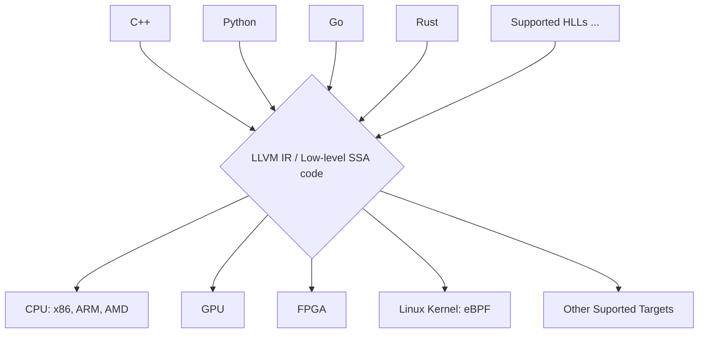

# My First LLVM Analysis Pass

## What is _LLVM_ ?
- LLVM[1] stands for **L**ow **L**evel **V**irtual **M**achine
- LLVM is a compiler framework designed to support program analysis and transformation (e.g., optimization, etc.) for any arbitrary program.
- It has its own low-level SSA based instruction set to represent a program and is independent of any target or runtime environment.
- We don't have to get deeper into LLVM at this point of time. 
- The below visalization[2] is enough to get a high level view about LLVM.

## Installation
- 

## Understanding where to place your pass

## What is _CMake_ ?

## Updating CMakeList

<!-- ## References -->
[1]: https://llvm.org/pubs/2004-01-30-CGO-LLVM.pdf
[2]: https://www.compilersutra.com/docs/llvm/llvm_basic/intro-to-llvm/
[3]: 
[4]: 